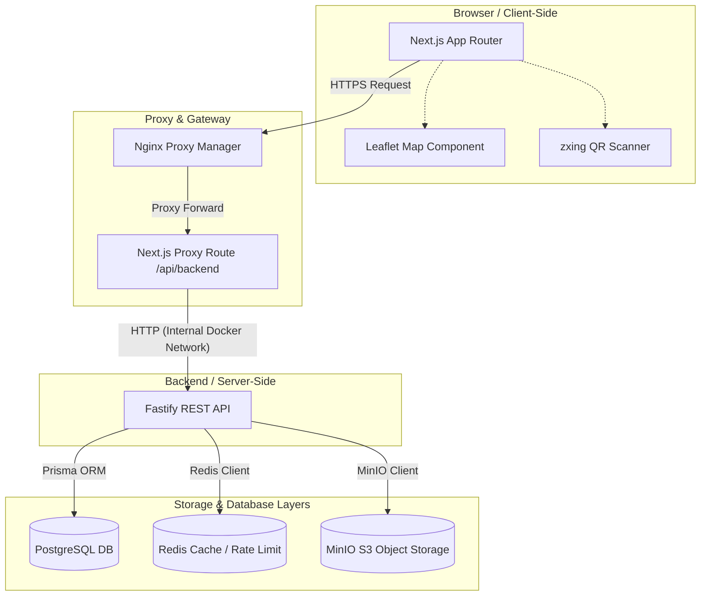

# VestGO — Arquitetura Técnica

Documentação de arquitetura de software e infraestrutura do ecossistema VestGO. Este guia reflete fielmente o estado real da implementação no código-fonte do monorepo, separando de forma honesta decisões implementadas de pendências técnicas.

---

## 1. Visão Geral do Sistema

O VestGO é projetado sob a arquitetura de **Monorepo Simples**, composto por um frontend Next.js 14 que atua como cliente e gateway de proxy, e um backend Fastify que serve como a API REST relacional.

Abaixo, apresentamos o diagrama de arquitetura simplificado no modelo C4, ilustrando as fronteiras dos containers, protocolos de comunicação e as camadas de armazenamento:



---

## 2. Estrutura do Monorepo

```text
VestGO/
├─ api/                       # Backend Fastify (Node.js + Prisma)
│  ├─ prisma/
│  │  ├─ schema.prisma        # Modelagem do banco relacional
│  │  ├─ seed.ts              # Massa de teste idempotente
│  │  └─ migrations/          # Histórico de migrations versionadas
│  ├─ src/
│  │  ├─ bootstrap/           # Rotinas de inicialização e admin bootstrap
│  │  ├─ modules/             # Módulos funcionais e rotas Fastify
│  │  ├─ plugins/             # Extensões do Fastify (Db, Redis, Auth, Storage)
│  │  ├─ shared/              # Utilitários globais (Validações, SMTP, Geocoding)
│  │  └─ server.ts            # Ponto de entrada do servidor
│  ├─ Dockerfile
│  ├─ package.json
│  └─ tsconfig.json
├─ web/                       # Frontend Next.js 14
│  ├─ app/
│  │  ├─ (public)/            # Rotas acessíveis sem autenticação
│  │  ├─ (app)/               # Rotas autenticadas com shell de aplicação
│  │  ├─ api/                 # Handlers locais (Auth.js & API Proxy)
│  │  └─ layout.tsx
│  ├─ components/             # Componentes modulares de UI
│  ├─ hooks/                  # Hooks customizados e controle de queries
│  ├─ lib/                    # Configurações de clientes (API, Auth.js)
│  ├─ public/                 # Assets estáticos e imagens
│  ├─ styles/                 # Configurações globais de CSS
│  ├─ middleware.ts           # Interceptador Next.js para rotas privadas
│  ├─ Dockerfile
│  └─ package.json
├─ infra/
│  └─ postgres/init.sql       # Script de inicialização (extensõesuuid-ossp e postgis)
├─ docs/
│  └─ PRODUCTION.md           # Guia de implantação em ambiente produtivo
├─ docker-compose.yml         # Compose principal (build local completo)
├─ docker-compose.dev.yml     # Compose de desenvolvimento (volumes locais)
├─ docker-compose.prod.yml    # Compose de produção (imagens GHCR e rede de proxy)
├─ .github/workflows/deploy.yml
├─ README.md
├─ ARCHITECTURE.md
└─ CONTEXT.md
```

---

## 3. Tecnologias e Versões Principais

Mapeamento derivado diretamente dos pacotes de manifesto (`package.json`) e imagens base:

### Backend (`api/`)
- **Runtime**: Node.js 20 (Dockerfile: `node:20-alpine`)
- **Framework**: Fastify ^4.28
- **ORM**: Prisma + `@prisma/client` ^5.15
- **Banco de Dados**: PostgreSQL 16 com extensão PostGIS (`postgis/postgis:16-3.4-alpine`)
- **Cache & Rate Limit**: Redis ^4.6 (Redis Server 7)
- **Object Storage**: MinIO Client ^7.1 (S3 compatível)
- **Segurança**: `bcrypt` ^5.1 (hasheamento de senhas) e `otplib` ^12 (geração de tokens TOTP)
- **Validação**: `zod` ^3.23

### Frontend (`web/`)
- **Framework**: Next.js 14.2.35 (App Router)
- **Biblioteca Web**: React 18.3
- **Autenticação**: `next-auth` ^5.0.0-beta.30 (Auth.js v5)
- **Gerenciamento de Estado**: `@tanstack/react-query` ^5.51
- **Estilização**: Tailwind CSS ^3.4 + `@tailwindcss/typography`
- **Animações & 3D**: `framer-motion` ^11, `three` ^0.168 e `@react-three/fiber`
- **Biblioteca de Mapas**: Leaflet ^1.9 e `react-leaflet` ^4.2
- **Mecanismos de QR Code**: `@zxing/browser` ^0.2 (leitura via câmera) e `react-qr-code` ^2 (geração)

---

## 4. Arquitetura do Frontend

### 4.1 Organização de Rotas (`web/app/`)
As rotas são estruturadas usando Route Groups do Next.js para isolamento de layouts e segurança:
- `(public)/`: Telas que não exigem autenticação do usuário. Inclui a landing page, telas de `/login`, `/cadastro`, mapa público de exploração `/mapa`, além de fluxos isolados como `/confirmar-email` e `/encerrar-conta`.
- `(app)/`: Telas autenticadas sob o layout corporativo `AppShell`. Contém `/inicio` (dashboard funcional), `/doar` (wizard de doação), `/rastreio` (visualização de timeline para doadores), `/operacoes` (painel operacional de fila, parcerias, solicitações de retirada e lotes de transporte para Pontos e ONGs) e as áreas de `/perfil` e `/configuracoes`.
- `api/auth/[...nextauth]/`: Ponto de entrada do Auth.js v5 que processa os callbacks de sessão e refresh.
- `api/backend/[...path]/`: Rota curinga que serve como proxy de rede, interceptando requisições HTTP do cliente e repassando para o endpoint do Fastify, mitigando problemas de CORS no navegador de maneira automatizada.

### 4.2 Mecanismo de Middleware (`web/middleware.ts`)
O middleware do Next.js monitora todas as rotas protegidas em tempo real. Se o token de sessão não estiver presente ou for inválido, o usuário é redirecionado para a tela de `/login` preservando a URL de origem como query parameter (`callbackUrl`). Adicionalmente, impede que usuários já autenticados acessem as páginas de cadastro e login.

### 4.3 Gestão de Sessão e Rotação de Refresh Token
A autenticação do lado do cliente é integrada ao fluxo JWT do Auth.js. No momento do login, o backend fornece o `accessToken` e o `refreshToken`. O callback `jwt` do Auth.js monitora a data de expiração do access token local. Quando este se aproxima da expiração, o Next.js realiza uma chamada silenciosa em background para `POST /auth/refresh` no backend, rotacionando a sessão. Em caso de falha física ou lógica no refresh, a sessão é marcada com erro (`RefreshAccessTokenError`) e o `account-session-guard` força o logout imediato da interface.

---

## 5. Arquitetura do Backend

### 5.1 Inicialização e Bootstrap
O ponto de entrada do backend (`api/src/server.ts`) configura a pilha de plugins essenciais (Prisma, Redis, Storage, CORS, JWT e Auth Decorators) de forma encadeada. Após a inicialização bem-sucedida da aplicação, a rotina `ensureBootstrapAdmin` analisa as variáveis de ambiente e injeta um usuário administrativo inicial no banco de dados de maneira totalmente idempotente.

### 5.2 Endpoints da REST API

Abaixo, listamos todos os endpoints mapeados, organizados por seu respectivo módulo funcional no código backend:

#### 📊 Health
- `GET /health` $\rightarrow$ Retorna o status operacional da API e conexão do banco.

#### 🔑 Autenticação (`api/src/modules/auth/`)
- `POST /auth/register` $\rightarrow$ Registro de novos usuários operacionais (bloqueia criação de admins).
- `POST /auth/login` $\rightarrow$ Validação inicial de credenciais (gera desafio TOTP se 2FA ativo).
- `POST /auth/2fa/verify-login` $\rightarrow$ Valida o código do segundo fator e devolve os tokens.
- `POST /auth/refresh` $\rightarrow$ Rotaciona o access token e refresh token.
- `POST /auth/logout` $\rightarrow$ Revoga a sessão de refresh token atual.
- `GET /auth/me` $\rightarrow$ Retorna os metadados do usuário atualmente autenticado.
- `POST /auth/change-password` $\rightarrow$ Altera a senha, revoga todas as sessões e emite novos tokens.
- `GET /auth/sessions` $\rightarrow$ Lista todas as sessões ativas do usuário logado.
- `DELETE /auth/sessions/:id` $\rightarrow$ Revoga uma sessão ativa pelo ID (impede revogar a si mesmo).
- `POST /auth/sessions/revoke-others` $\rightarrow$ Revoga todas as outras sessões de dispositivos conectados.
- `GET /auth/2fa/status` $\rightarrow$ Verifica se o 2FA está habilitado na conta.
- `POST /auth/2fa/setup` $\rightarrow$ Gera o segredo TOTP e a URI para escaneamento no app autenticador.
- `POST /auth/2fa/confirm` $\rightarrow$ Confirma o código do setup inicial e gera os códigos estáticos de recuperação.
- `POST /auth/2fa/disable` $\rightarrow$ Desativa o segundo fator de autenticação da conta.
- `POST /auth/2fa/recovery-codes/regenerate` $\rightarrow$ Invalida códigos antigos e gera uma nova lista de recuperação.
- `POST /auth/verify-email` $\rightarrow$ Confirma a verificação do e-mail com base em token temporário.
- `POST /auth/request-email-verification` $\rightarrow$ Gera e dispara e-mail com link de confirmação de conta.
- `POST /auth/account-deletion/request` $\rightarrow$ Solicita o encerramento da conta e dispara link de confirmação.
- `POST /auth/account-deletion/confirm` $\rightarrow$ Valida a confirmação final de exclusão e anonimiza os dados.
- *Nota: As rotas `POST /auth/request-password-reset` e `POST /auth/reset-password` são parciais, o que significa que o frontend tenta consumi-las, mas elas ainda não foram codificadas na API.*

#### 👤 Perfis (`api/src/modules/profiles/` e `api/src/modules/admin/`)
- `GET /profiles/me` $\rightarrow$ Retorna o perfil completo do usuário atual.
- `PATCH /profiles/me` $\rightarrow$ Atualiza dados e atributos operacionais.
- `PATCH /profiles/me/email-preferences` $\rightarrow$ Configura preferências de notificação por e-mail.
- `GET /admin/profiles` $\rightarrow$ Painel de governança administrativa para listagem de perfis.
- `PATCH /admin/profiles/:id/status` $\rightarrow$ Aprova, rejeita ou suspende o estado público operacional de um perfil.
- `PATCH /admin/profiles/:id/revision` $\rightarrow$ Valida ou rejeita uma revisão pública crítica pendente.

#### 📍 Geolocalização & Endereço (`api/src/modules/addresses/` e `api/src/modules/collection-points/`)
- `GET /addresses/suggestions` $\rightarrow$ Fornece autocomplete geográfico de endereço estruturado.
- `GET /addresses/reverse` $\rightarrow$ Converte coordenadas lat/long em endereço textual.
- `GET /collection-points` $\rightarrow$ Lista pública filtrável de pontos de coleta ativos e verificados.
- `GET /collection-points/:id` $\rightarrow$ Metadados públicos de um ponto de coleta específico.

#### 📦 Doações (`api/src/modules/donations/` e `api/src/modules/operational-donations/`)
- `POST /donations` $\rightarrow$ Cria um novo registro de doação direcionado a um ponto de coleta ativo.
- `GET /donations` $\rightarrow$ Lista histórica das doações criadas pelo doador atual.
- `GET /donations/operations` $\rightarrow$ Fila de doações ativas para visualização operacional de Pontos e ONGs.
- `GET /donations/:id` $\rightarrow$ Detalhes de uma doação específica.
- `GET /donations/:id/timeline` $\rightarrow$ Histórico e eventos sequenciais de mudança de status da doação.
- `PATCH /donations/:id/status` $\rightarrow$ Transiciona o status da doação na fila logística.
- `GET /operational-donations/by-code/:code` $\rightarrow$ Recupera metadados da doação a partir do código legível por QR.

#### 🤝 Parcerias Logísticas (`api/src/modules/partnerships/` e `api/src/modules/pickup-requests/`)
- `GET /partnerships` $\rightarrow$ Lista de convênios estabelecidos.
- `POST /partnerships` $\rightarrow$ Cria uma solicitação de parceria direcionada entre um Ponto de Coleta e uma ONG.
- `PATCH /partnerships/:id/status` $\rightarrow$ Aceita ou rejeita o convênio de cooperação logística.
- `GET /pickup-requests` $\rightarrow$ Retorna o histórico de solicitações de retirada da parceria.
- `POST /pickup-requests` $\rightarrow$ Emite solicitação de retirada de doações consolidadas.
- `PATCH /pickup-requests/:id/status` $\rightarrow$ Altera a aprovação operacional da retirada.

#### 🚚 Lotes Operacionais (`api/src/modules/operational-batches/`)
- `GET /operational-batches` $\rightarrow$ Lista de lotes logísticos.
- `GET /operational-batches/by-code/:code` $\rightarrow$ Encontra o lote logístico a partir do código do QR Code de saca.
- `POST /operational-batches` $\rightarrow$ Abre um novo lote operacional associado à parceria.
- `GET /operational-batches/:id` $\rightarrow$ Detalhes de itens e transporte do lote.
- `POST /operational-batches/:id/items` $\rightarrow$ Vincula doações consolidadas ao lote de transporte.
- `DELETE /operational-batches/:id/items/:itemId` $\rightarrow$ Remove doações associadas do lote.
- `POST /operational-batches/:id/mark-ready` $\rightarrow$ Altera o status do lote para pronto para embarque (`READY_TO_SHIP`).
- `POST /operational-batches/:id/dispatch` $\rightarrow$ Transiciona o lote para em trânsito logístico (`IN_TRANSIT`).
- `POST /operational-batches/:id/confirm-delivery` $\rightarrow$ Registra a entrega física das sacas na sede da ONG (`DELIVERED`).
- `POST /operational-batches/:id/close` $\rightarrow$ Finaliza a auditoria interna e encerra o ciclo do lote (`CLOSED`).
- `POST /operational-batches/:id/cancel` $\rightarrow$ Cancela a expedição e libera os itens associados de volta à fila (`CANCELLED`).

#### 🎮 Gamificação (`api/src/modules/gamification/`)
- `GET /gamification/me` $\rightarrow$ Retorna a gamificação do doador logado (nível, pontos, conquistas ativas).
- `POST /gamification/me/sync` $\rightarrow$ Sincroniza e audita as conquistas e pontuações do usuário logado de forma atômica no banco de dados.

#### 🔔 Notificações e Mídias (`api/src/modules/notifications/` e `api/src/modules/uploads/`)
- `GET /notifications` $\rightarrow$ Lista de notificações in-app direcionadas ao usuário.
- `PATCH /notifications/:id/read` $\rightarrow$ Marca uma notificação específica como lida.
- `PATCH /notifications/read-all` $\rightarrow$ Define todas as notificações pendentes como lidas de forma agregada.
- `POST /uploads` $\rightarrow$ Realiza o upload de arquivos de imagem no MinIO validando extensões e cabeçalhos binários.
- `GET /uploads/:key` $\rightarrow$ Retorna a mídia gravada como stream direto do bucket S3.

---

## 6. Banco de Dados & Modelo do Prisma

### 6.1 Estratégia de Persistência
- O banco PostgreSQL armazena dados estruturados relacionais, enquanto a extensão **PostGIS** é carregada para garantir a indexação espacial rápida de latitude e longitude dos perfis e pontos de coleta cadastrados.
- Toda modificação de schema de banco é controlada exclusivamente por meio de **migrations versionadas** do Prisma (`api/prisma/migrations/`).
- O ecossistema de containers aplica `prisma migrate deploy` na inicialização do serviço do backend, eliminando a dependência do comando destrutivo `db push` em ambientes produtivos.

### 6.2 Modelagem de Dados Resumida
Para garantir máxima eficiência no desenvolvimento e evitar sobrecarga de joins nas consultas geográficas, o modelo de banco adota um padrão pragmático:
- **Tabela `User`**: Centraliza os metadados de credencial do usuário, preferências de e-mail e os dados operacionais estruturados do perfil (logradouro, número, bairro, CEP, lat/long, CNPJ, acessibilidade, checklists e imagens). Alterações sensíveis em perfis ativos ficam isoladas em formato JSON no campo `pendingPublicRevision` até a auditoria admin.
- **Tabela `PointLedger`**: Registra o histórico atômico de transações de entrada e saída de pontos de gamificação do doador, garantindo rastreabilidade contra fraudes.
- **Tabela `UserAchievement`**: Armazena os registros de conquistas desbloqueadas pelos doadores, referenciando uma das 10 conquistas públicas ou 5 conquistas secretas Ruby.
- **Tabelas de Ciclo Logístico**: Compostos por `Donation` (itens de roupas vinculados), `OperationalPartnership` (vínculos ponto-ONG), `PickupRequest` (retiradas de sacas) e `OperationalBatch` (consolidador logístico de sacas).

---

## 7. Infraestrutura de Produção e Docker

O `docker-compose.prod.yml` isola completamente a stack do host externo. Os containers rodam em uma rede interna isolada, e apenas os serviços que exigem contato com a web participam da rede externa do proxy reverso (`NPM_EXTERNAL_NETWORK`), controlada pelo **Nginx Proxy Manager**.

A terminação SSL, emissão automatizada do Let's Encrypt e filtros de segurança ocorrem na borda (Proxy). A comunicação interna Docker flui livremente em HTTP puro entre os containers, aumentando consideravelmente a segurança do ecossistema.

---

## 8. Segurança e Conformidade

### Lógicas Implementadas
1. **Segredo AES**: TOTP segredo criptografado no Postgres usando AES com a chave `TWO_FACTOR_ENCRYPTION_KEY`.
2. **Criptografia de Sessão**: Hash SHA-256 das sessões no Redis contra sequestros de tokens.
3. **Validação de Magic Bytes**: Checagem de cabeçalhos binários nas fotos de uploads impedindo a injeção de scripts maliciosos em arquivos de extensão disfarçada.
4. **Anonimização**: Fluxo em conformidade com privacidade que zera dados pessoais sob `User.anonymizedAt` de maneira irreversível no banco de dados.

---

## 9. Estado Atual da Integração Frontend ↔ Backend

| Área Funcional | Frontend | Backend | Estado Real |
| --- | --- | --- | --- |
| Autenticação, Logout & Refresh | OK | OK | Implementado |
| Segundo Fator (2FA TOTP) | OK | OK | Implementado |
| Gerenciamento de Sessões Ativas | OK | OK | Implementado |
| Perfis Operacionais & Governança | OK | OK | Implementado |
| Mapa de Descoberta & Autocomplete | OK | OK | Implementado |
| Wizard de Doação | OK | OK | Implementado |
| Operações, Retiradas & Lotes | OK | OK | Implementado |
| Notificações In-App | OK | OK | Implementado |
| Upload de Mídias (MinIO) | OK | OK | Implementado |
| QR Code (Leitura & Geração) | OK | OK | Implementado |
| Verificação de E-mail de Conta | OK | OK | Implementado |
| Encerramento de Conta / Anonimizar | OK | OK | Implementado |
| Gamificação Base (Pontos/Níveis) | OK | OK | Implementado (Funcional no backend) |
| Recuperação de Senha | OK | **Faltando rotas** | Parcial (Pendente backend) |
| E-mails Logísticos Complementares | — | Apenas templates | Pendente |
| WebSockets em Tempo Real | — | — | Planejado |

---

## 10. Débitos Técnicos e Decisões

1. **Desenvolvimento das Rotas de Password Reset**: Necessidade de criar `POST /auth/request-password-reset` e `POST /auth/reset-password` no backend para fechar o ciclo de recuperação de senha iniciado no web.
2. **Ausência de Suite de Testes**: Mapeamento e configuração futura de testes unitários e de integração utilizando ferramentas como Vitest e Playwright.
3. **Consolidação das Regras de Gamificação**: Sincronizar o cache frontend do arquivo `web/lib/gamification.ts` diretamente com a resposta da API do backend em `/gamification/me` para evitar discrepâncias locais de visualização de badges.
