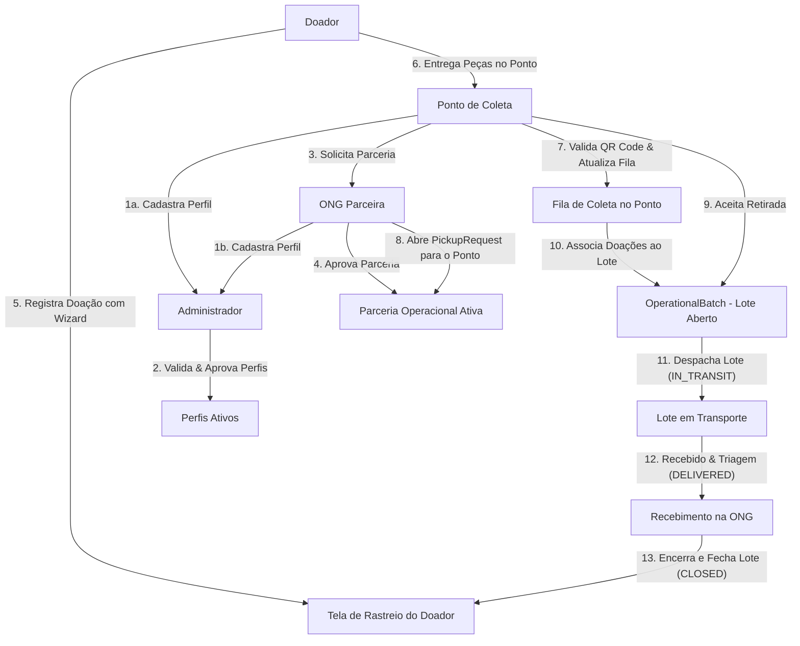

<p align="center">
  
</p>

<h1 align="center">VestGO</h1>

<p align="center">
  <strong>Plataforma solidária full-stack que conecta e rastreia o ciclo de vida real da doação de peças de vestuário: do doador ao ponto de coleta e às ONGs operacionais parceiras.</strong>
</p>

<p align="center">
  
  
  
  
  
  
  
  
</p>

---

<p align="center">
  <a href="#sobre-o-projeto">
    
  </a>
  <a href="#fluxo-técnico-principal">
    
  </a>
  <a href="#matriz-de-funcionalidades">
    
  </a>
  <a href="#como-rodar-localmente">
    
  </a>
</p>

<p align="center">
  <a href="./ARCHITECTURE.md">
    
  </a>
  <a href="./docs/PRODUCTION.md">
    
  </a>
</p>

---

## 📌 Sumário

- [Sobre o Projeto](#sobre-o-projeto)
- [Problema que o Projeto Busca Resolver](#problema-que-o-projeto-busca-resolver)
- [Público-Alvo](#público-alvo)
- [Fluxo Técnico Principal](#fluxo-técnico-principal)
- [Matriz de Funcionalidades](#matriz-de-funcionalidades)
- [Limitações Conhecidas](#limitações-conhecidas)
- [Como Rodar Localmente](#como-rodar-localmente)
- [Documentação Complementar](#documentação-complementar)

---

## 📖 Sobre o Projeto

O **VestGO** é uma plataforma web full-stack monorepo projetada para digitalizar, organizar e auditar a jornada de doação de roupas, calçados e acessórios. Conectamos de forma transparente os três atores centrais do ciclo de doações:
- **Doadores**: pessoas físicas que desejam destinar suas peças de forma estruturada.
- **Pontos de Coleta**: estabelecimentos ou postos físicos que recebem as doações e gerenciam a triagem inicial.
- **ONGs Parceiras**: organizações do terceiro setor encarregadas de coletar os materiais consolidados e dar a destinação final útil a quem precisa.

A plataforma foca no rastreamento e na transparência: do registro inicial da doação ao momento em que a peça é integrada a um lote operacional, transportada e entregue à ONG parceira.

> 🎓 **Status Acadêmico**: Desenvolvido em contexto universitário (Facens) como projeto de conclusão/trabalho integrador de curso. A plataforma adota uma abordagem incremental, declarando com extrema franqueza seu estado real de código e as limitações de produto em sua documentação.

---

## 🎯 Problema que o Projeto Busca Resolver

O fluxo tradicional de doação de roupas frequentemente falha por falta de transparência e descentralização:
- **Doadores** sentem desconfiança por não saber se suas peças de fato chegaram a quem precisa.
- **Pontos de Coleta** acumulam sacas e caixas de doação sem capacidade logística para destinar de forma ordenada.
- **ONGs Parceiras** sofrem com oscilações de estoque, falta de previsibilidade de recebimento de materiais e ausência de trilha digital para triagem e auditoria.

## Funcionalidades

A lista abaixo separa por estado real no código.

### Implementadas

- Cadastro e login com Auth.js + JWT/refresh token no backend
- Refresh automático de access token e logout controlado quando o refresh falha
- Bootstrap admin temporário via variáveis de ambiente
- Papéis: `DONOR`, `COLLECTION_POINT`, `NGO`, `ADMIN`
- Cadastro público bloqueando criação de `ADMIN`
- Wizard de doação restrito a `DONOR`, com integração ao mapa para escolha do ponto
- Mapa público (`/mapa`) com Leaflet, geolocalização automática e fallback para Sorocaba
- Busca textual de parceiros + camada adicional de sugestão de endereço/lugar
- Endereço estruturado (logradouro, número, complemento, bairro, CEP, cidade, estado, lat/long)
- Autocomplete de endereço servido pelo backend (provider Mapbox ou Nominatim)
- Geocoding no save do perfil operacional
- Perfil operacional com checklist e estados públicos `DRAFT` / `PENDING` / `ACTIVE` / `VERIFIED`
- Revisão pendente de alterações públicas críticas em perfis aprovados
- Governança em `/admin/perfis` para aprovação inicial e revisões pendentes
- Parceria operacional ponto → ONG com estados `PENDING` / `ACTIVE` / `REJECTED`
- Solicitação de retirada (PickupRequest) entre ONG e ponto parceiro
- Lotes operacionais (OperationalBatch) com fluxo `OPEN` → `READY_TO_SHIP` → `IN_TRANSIT` → `DELIVERED` → `CLOSED`
- Notificações in-app persistidas no banco (sem websocket; refetch + polling)
- Uploads via MinIO para avatar, capa e galeria pública (validação de MIME e magic bytes)
- Leitura de QR de doação para o fluxo operacional (zxing-js no navegador)
- 2FA TOTP no backend (setup/confirm/disable, códigos de recuperação)
- Sessões ativas: listagem, revogação individual e "sair de outros dispositivos"
- Rate limit por IP e por e-mail no login (Redis)
- Verificação de e-mail (envio do link e confirmação)
- Encerramento de conta com anonimização (`/auth/account-deletion/request` e `/auth/account-deletion/confirm`)
- Redefinição de senha completa (endpoints `POST /auth/request-password-reset` e `POST /auth/reset-password` no backend, envio seguro de templates de e-mail com SMTP fallback, sem login automático pós-reset, revogação de sessões e tokens PASSWORD_RESET anteriores)
- E-mails operacionais transacionais com layout HTML rico e e-mail em texto puro para todas as transações operacionais importantes (parcerias, retiradas de coleta, lote pronto/despachado/entregue/fechado), com desduplicação automática e respeito às preferências do usuário
- Gamificação no frontend sincronizada com os thresholds do backend (`/gamification/me`)
- Validação de CPF e telefone no backend e no frontend (`api/src/shared/cpf.ts`, `phone.ts`)
- Lista de cidades/estados brasileiros para autocomplete (`brazil-locations.ts`)
- Banner de consentimento de cookies (`cookie-consent-banner.tsx` + `cookie-consent.ts`)
- Guarda de sessão de conta (`account-session-guard.tsx`) integrada ao shell autenticado
- Layout responsivo, dark mode, navegação role-aware (sidebar, topbar e bottom nav)

### Parcialmente implementadas

- **Gamificação**: curva de níveis no frontend (`web/lib/gamification.ts`) sincronizada com os thresholds oficiais do backend. As regras de badges e pontos no backend mantêm-se em sua estrutura atual.
- **Página `/pontos`**: redireciona para `/mapa`, mantida apenas por compatibilidade.

### Planejadas / pendentes

- Push notifications, e-mail transacional para todos os eventos e WebSocket
- Sugestão de parceiros por proximidade operacional.
- Semântica operacional própria no rastreio (atualmente compartilha estados com a fila)
- Métricas de impacto e dashboards mais ricos.
- Testes automatizados (não há suíte de testes no repositório)

---

## 👥 Público-Alvo

- **Doadores (`DONOR`)**: Buscam facilidade para registrar suas doações, encontrar pontos de coleta convenientes por proximidade no mapa e acompanhar a evolução do rastreio.
- **Pontos de Coleta (`COLLECTION_POINT`)**: Necessitam gerenciar sua fila de entrada, controlar as parcerias logísticas e emitir de forma organizada as solicitações de retirada de caixas ou sacas.
- **ONGs Parceiras (`NGO`)**: Desejam formalizar convênios de recebimento com os pontos físicos, gerenciar rotas de retirada, consolidar lotes logísticos de transporte e registrar o encerramento do ciclo.
- **Administradores (`ADMIN`)**: Responsáveis por moderar, aprovar ou auditar novos cadastros operacionais e controlar revisões públicas críticas do sistema.

---

## 🔄 Fluxo Técnico Principal

O diagrama abaixo ilustra o ciclo operacional que rege a plataforma do início ao fim:



---

## 📊 Matriz de Funcionalidades

Mapeamento honesto baseado na auditoria profunda conduzida diretamente sobre o código-fonte do monorepo:

### ✅ Implementadas e Funcionais
- **Autenticação Avançada**: Login e registro com Auth.js + token JWT e rotação de Refresh Token persistido e renovado de forma segura no backend.
- **Proteção 2FA (TOTP)**: Segundo fator de autenticação nativo (setup, confirmação e revogação via códigos temporários e backup) com chaves de criptografia AES e Redis no backend.
- **Rate Limiting**: Bloqueio de ataques de força bruta no login limitado de forma inteligente por IP e por e-mail no backend com Redis.
- **Sessões Ativas**: Listagem de conexões, revogação cirúrgica individual e opção global de "Sair de todos os outros dispositivos".
- **Encerramento de Conta com Anonimização**: Fluxo de conformidade que apaga dados pessoais de perfil e anonimiza o histórico operacional no banco de dados (`User.anonymizedAt`).
- **Verificação de E-mail**: Rota nativa e tokens temporários seguros com envio de links e tela de confirmação (`/confirmar-email`).
- **Wizard de Doação**: Fluxo guiado em etapas exclusivo para doadores com preenchimento estruturado, escolha intuitiva de pontos no mapa e geração instantânea de QR Code dinâmico.
- **Mapa Interativo**: Mapa público robusto servido via Leaflet, com suporte a geolocalização nativa do navegador e fallback para Sorocaba-SP.
- **Autocomplete de Endereço**: Autocomplete completo integrado e servido pelo backend (`/addresses/suggestions`), usando providers como Mapbox ou Nominatim.
- **Geocoding Automático**: Conversão automática de endereço para coordenadas geográficas (lat/long) no salvamento de perfis no banco.
- **Governança de Perfis**: Fluxo administrativo robusto para aprovação inicial de perfis e retenção temporária para auditoria de alterações públicas críticas em perfis já ativos (`pendingPublicRevision`).
- **Parcerias Logísticas**: Sistema de vinculação ponto-ONG (`OperationalPartnership`) com controle rígido de status (`PENDING` / `ACTIVE` / `REJECTED`).
- **Fluxo Logístico Completo**: Criação de solicitações de retirada (`PickupRequest`) e agrupamento de sacas em lotes (`OperationalBatch`) guiados pelas transições: `OPEN` $\rightarrow$ `READY_TO_SHIP` $\rightarrow$ `IN_TRANSIT` $\rightarrow$ `DELIVERED` $\rightarrow$ `CLOSED`.
- **Notificações In-App**: Sistema de notificações in-app persistido em banco de dados com polling inteligente e controle de versões de requisição contra refetch fora de ordem no frontend.
- **Uploads com Validação**: Armazenamento no MinIO de imagens de perfil, capa e galeria operacional, validando extensão, tamanho máximo (5MB), MIME types e magic bytes no backend.
- **Leitura Nativa de QR Code**: Leitura de QR Codes integrada no frontend web em tempo real por meio da webcam usando `@zxing/browser`.
- **Validações Padrão Brasil**: Rotinas completas de formatação e validação de CPF e telefone no backend e frontend.
- **Gamificação Funcional no Backend**: Cálculo de pontos, 30 níveis (de *Primeiro Gesto* a *Herói Solidário Supremo*), ledger de pontos (`PointLedger`), persistência e sincronização de dados via API pelas rotas `/gamification/me` e `/gamification/me/sync`. A experiência visual e refinamentos de produto podem evoluir incrementalmente.
  - **10 Conquistas Públicas** e **5 Conquistas Secretas Ruby** (`medal-hunter`, `community-ambassador`, `unstoppable`, `supreme-donor`, `supreme-solidarity-hero`).
- **Acessibilidade e Usabilidade**: Layout moderno e vivo, Dark/Light Mode persistido, barra de navegação responsiva adaptada para telas móveis e desktop, e menu lateral customizado por papel de usuário (`DONOR`, `COLLECTION_POINT`, `NGO`, `ADMIN`).

### ⚠️ Parcialmente Implementadas (Mistas)
- **Redefinição de Senha**: Telas de solicitação (`/esqueci-senha`) e de redefinição (`/redefinir-senha`) prontas no frontend. Cliente HTTP e templates de e-mail preparados. No entanto, **as rotas `/auth/request-password-reset` e `/auth/reset-password` no backend ainda não foram criadas**.
- **E-mails Operacionais**: Envio ativo apenas para "registro de doação" e "mudança de status de doação". Outros disparos logísticos ainda dependem de integrações futuras de templates.
- **Página `/pontos`**: Mantida apenas por compatibilidade legado, redirecionando o usuário para o mapa interativo global `/mapa`.

### 🛑 Planejadas / Pendentes (Fora do Escopo Atual)
- **Mensageria em Tempo Real**: WebSocket nativo ou Push Notifications no navegador.
- **Inteligência Logística**: Sugestões automáticas de pontos de coleta ou ONGs baseando-se em proximidade geográfica de lat/long ou capacidade operacional.
- **Dashboards Ricos**: Painéis analíticos e relatórios agregados de métricas de impacto socioambiental.
- **Testes Automatizados**: Atualmente o monorepo não possui nenhuma suíte de testes unitários ou de integração (Vitest, Jest ou Playwright).

---

## 🚫 Limitações Conhecidas

- Não existe suíte de testes automatizados.
- Notificações dependem de polling/refetch — não há WebSocket nem push.
- O rastreio do doador compartilha lógica com a fila operacional; ainda não tem timeline própria.
- Gamificação é estrutural, mas as regras de pontuação são limitadas.
- Não há dashboards de métricas/impacto consolidados.

---

## 🚀 Como Rodar Localmente

### Pré-requisitos
- Docker & Docker Compose instalados no sistema host.
- Node.js 20+ (opcional, apenas para desenvolvimento local fora dos containers).

### 🛠️ Caminho Recomendado (Docker Compose)

O Docker Compose sobe toda a stack, executa as migrações do banco automaticamente e provisiona a infraestrutura local em poucos instantes:

```bash
# 1. Copie o arquivo de exemplo de variáveis de ambiente
cp .env.example .env

# 2. Suba todos os serviços orquestrados
docker compose up -d --build
```

#### Endereços Locais
- **Frontend Web**: [http://localhost:3000](http://localhost:3000)
- **API Backend**: [http://localhost:3001](http://localhost:3001)
- **MinIO Console**: [http://localhost:9001](http://localhost:9001) (acesso: `minioadmin` / `minioadmin` conforme `.env.example`)
- **PostgreSQL**: Acessível na porta local `5433` no host (mapeado da porta interna `5432`).

---

## 📚 Documentação Complementar

- 📘 [ARCHITECTURE.md](./ARCHITECTURE.md): Documento de arquitetura com diagramas C4 e mapeamento de endpoints Fastify.
- 📙 [docs/PRODUCTION.md](./docs/PRODUCTION.md): Manual passo a passo para deploy em ambientes reais e procedimentos manuais recomendados de backup.
- 🤖 [CONTEXT.md](./CONTEXT.md): Briefing consolidado estruturado para leitura de agentes externos e outras IAs de desenvolvimento.
- 📄 [.env.example](./.env.example): Modelo mapeado das variáveis de configuração da aplicação.
